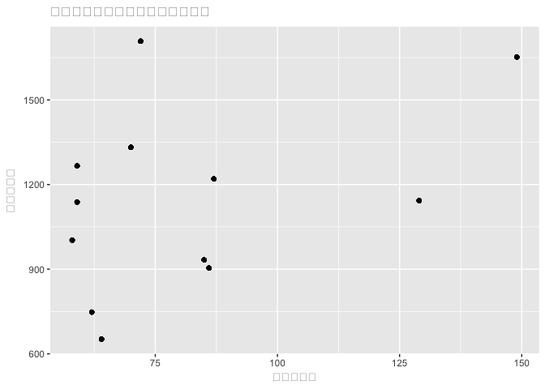
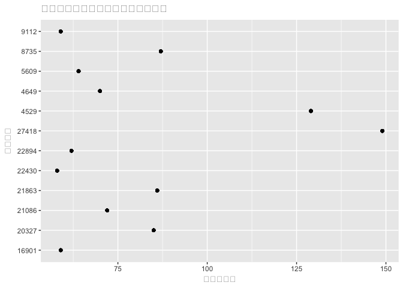
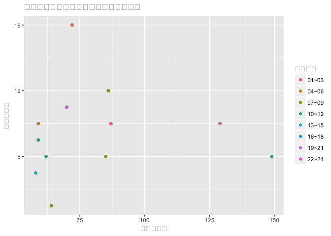

台北市竊盜事件探討
================

組員
----

陳哲安 劉喜媚

分析議題背景
------------

台北市為全台灣的政經中心，聚集了各式各樣的人才、企業，也因此人口流動快速。然而，人口眾多相對也容易造成一些竊盜的事件發生， 如何有效的去預防、追查竊盜事件發生，也是當務之急。

分析動機
--------

生為台灣的首都，許多的竊盜事件都容易影響台灣的形象，因此如何有效的預防、追查竊盜事件是很重要的。預計透過台北市人口資料、警察局分配位置、竊盜事件發生位置來探討個區域的安全性，或是作為警察局建立攝影機的參考。

使用資料
--------

1.臺北市汽車竊盜點位資訊 來源：台北市政府資料開放平台 資料類型：CSV 主要欄位：案類(Type)、發生(現)日期(Date) 、發生時段(Time)、地點(Location) 日期：106年03月13日

2.臺北市自行車竊盜點位資訊 來源：台北市政府資料開放平台 資料類型：CSV 主要欄位：案類(Type)、發生(現)日期(Date) 、發生時段(Time)、地點(Location) 日期：106年03月13日

3.臺北市政府警察局名稱及地址 來源：台北市政府資料開放平台 資料類型：CSV 主要欄位：標題、內容、交通資訊、顯示用地址、系統辨識用地址
日期：106年03月14日

4.村里戶數、單一年齡人口 來源：內政部資料開放平台 資料類型：CSV 主要欄位：戶數、單一年齡性別、單一年齡人口數 日期：106年01月18日

5.鄉鎮市區界線(TWD97經緯度) 來源：政府資料開放平台 資料類型：SHP 主要欄位：鄉(鎮、市、區)界線(TWD97經緯度) 日期：104年10月07日

6.各鄉鎮市區人口密度 來源：政府資料開放平台 資料類型：CSV 主要欄位：統計年、區域別、年底人口數、土地面積、人口密度 日期：106年01月13日

7.臺北市新錄影監視系統第1期設置地點清冊 來源：台北市政府資料開放平台 資料類型：CSV 主要欄位：分局、派出所、攝影機編號、設置地點 日期：104年10月08日

8.臺北市各級學校分布圖(含國小.國中.高中職.特教學校.市立大專院校) 來源：台北市政府資料開放平台 資料類型：CSV 主要欄位：school(學校種類)、school\_name(學校名稱) 、postal\_code(郵遞區號) 、address(地址) 、telephone(電話)、rem(備註) 日期：105年01月15日

載入使用資料們

``` r
#install.packages("data.table")
library(data.table)
car <- fread("~/Desktop/R Final/txt/car.txt" ,colClasses = "character")
bike <- fread("~/Desktop/R Final/txt/bike.txt" ,colClasses = "character")
police <- fread("~/Desktop/R Final/txt/police.txt" ,colClasses = "character")
people <- fread("~/Desktop/R Final/opendata10512M030.csv",colClasses = "character" , skip = 1)
land <- fread("~/Desktop/R Final/opendata105N010.csv",colClasses = "character" , skip = 1)
camera <- fread("~/Desktop/R Final/1041008.csv",colClasses = "character")
school <- fread("~/Desktop/R Final/txt/1050113臺北市各級學校分布圖%2528含國小_國中_高中職_特教學校_市立大學%25291030730+%281%29.txt",colClasses = "character")
```

資料處理與清洗
--------------

-   從台灣總人口數的表，清出只有台北市的資料，再去統整台北市各區域的人口數
-   統計台北市各區域汽車偷竊次數
-   統計台北市各區域自行車偷竊次數
-   統計台北市各區域警察局量
-   清洗出台北市各區域人口密度
-   統計台北市各區域監視器數量
-   統計台北市各區域學校數量（不分層級）

處理資料

``` r
library(dplyr)
```

    ## -------------------------------------------------------------------------

    ## data.table + dplyr code now lives in dtplyr.
    ## Please library(dtplyr)!

    ## -------------------------------------------------------------------------

    ## 
    ## Attaching package: 'dplyr'

    ## The following objects are masked from 'package:data.table':
    ## 
    ##     between, first, last

    ## The following objects are masked from 'package:stats':
    ## 
    ##     filter, lag

    ## The following objects are masked from 'package:base':
    ## 
    ##     intersect, setdiff, setequal, union

``` r
##人口表
##people_taipei 只有台北市的人口資料
##people_taipei_area 台北市各區域的總人口，男生人口，女生人口
people_taipei <- people[grepl("臺北市",people$區域別),]
people_taipei_area <- group_by(people_taipei,區域別) %>% summarise(people_total = sum(as.numeric(人口數)) , people_man = sum(as.numeric(`人口數-男`)) , people_woman = sum(as.numeric(`人口數-女`)))
people_taipei_area$地區 <- substr(people_taipei_area$區域別 , start = 4 , stop = 6)

##汽車偷竊
##cartotal 台北市各區域汽車偷竊次數
car$地區 <- substr(car$`發生(現)地點`,start = 4,stop = 6)
cartotal <- group_by(car,地區) %>% summarise(carnumber = n()) #地區&時段

##自行車偷竊
##biketotal 台北市各區域自行車偷竊次數
bike$地區 <- substr(bike$`發生(現)地點` , start = 4 , stop = 6) 
biketotal <- group_by(bike,地區) %>% summarise(bikenumber = n())

##警察局
##台北市各區域警察局總數
police$地區 <- substr(police$poi_addr , start = 4 , stop = 6)
policetotal <-  group_by(police,地區) %>% summarise(policenumber = n())

##人口密度
##land_taipei 臺北市資料
land_taipei <- land[grepl("臺北市",land$區域別),]
land_taipei$地區 <- substr(land_taipei$區域別 , start = 4 , stop = 6)
land_taipei_need <-land_taipei[,c(5,6)]

##監視器
##
camera_need <- camera[,c(3,5)]
camera_need$precinct <- substr(camera_need$precinct , start = 1 , stop = 2)
camera_need$地區 <- ifelse(camera_need$precinct=="",yes="",no = paste0(camera_need$precinct,"區"))
camera_need <- camera_need[!precinct==""]
freq_location_taipei<-camera_need[,.N,by = 地區]
colnames(freq_location_taipei) <- c("地區","camera_number")

##學校
school[grepl('中崙高中',school_name)]$address <- "臺北市松山區八德路四段101號"
school[grepl('中崙高中',school_name)]$address <- iconv(school[grepl('中崙高中',school_name)]$address,"utf-8","utf-8")
school$地區 <- substr(school$address , start = 4 , stop = 6)
school_total <- school[,.N,by = "地區"]
colnames(school_total) <- c("地區","school_number")

#以學校層級分
school_byschool <- school[,.N,by = school]
colnames(school_byschool) <- c("school","school_number")

##資料結合
##merge3 有台北市各區域總人口、男生人口數、女生人口數、汽車發生偷竊次數、自行車發生偷竊次數、警察局總數
merge1 <- full_join(people_taipei_area,cartotal,by="地區")
merge2 <- full_join(merge1,biketotal,by="地區")
merge3 <- full_join(merge2,policetotal,by="地區")
merge4 <- full_join(merge3,land_taipei_need,by="地區")
merge5 <- merge(merge4,freq_location_taipei,by="地區")
merge6 <- full_join(merge5,school_total,by="地區")
```

探索式資料分析
--------------

圖文並茂圖文並茂

``` r
#這是R Code Chunk
# install.packages("showtext")
library(dplyr)
library(showtext)
```

    ## Loading required package: sysfonts

``` r
showtext.auto(enable = TRUE)

library(ggplot2)
merge3<-mutate(merge3, "竊盗總數"=carnumber+bikenumber)

summary(merge3$bikenumber)
```

    ##    Min. 1st Qu.  Median    Mean 3rd Qu.    Max. 
    ##    7.00    9.75   14.00   17.42   21.25   44.00

``` r
hist.bike<-merge3$bikenumber
names(hist.bike)<-merge3$地區
summary(merge3$carnumber)
```

    ##    Min. 1st Qu.  Median    Mean 3rd Qu.    Max. 
    ##   41.00   44.50   55.00   64.25   73.50  142.00

``` r
hist.car<-merge3$carnumber
names(hist.car)<-merge3$地區
x.par <- par(mfrow = c(1,2))
barplot(hist.car, xlab = "區域別", ylab = "次數", main ="自行車在各區被竊盗的次數",density=5)
barplot(hist.bike, xlab = "區域別", ylab = "次數", main ="車在各區被竊盗的次數",density=5, ylim=c(0, 140))
```


``` r
par(x.par)
#車被竊盗的量比自行車的量高出很多 

shapiro.test(merge3$竊盗總數)  
```

    ## 
    ##  Shapiro-Wilk normality test
    ## 
    ## data:  merge3$竊盗總數
    ## W = 0.78156, p-value = 0.005825

``` r
#不服從常態分配
cor(merge3$竊盗總數, merge3$policenumber) 
```

    ## [1] 0.02131421

``` r
#各區警察局的數量與竊盗總數的相關係數皆趨近於零，線性關係很底。
cov(merge3$竊盗總數, merge3$policenumber) 
```

    ## [1] 1.727273

``` r
#各區警察局的數量與竊盗總數的共變異數的絕對值皆<2,線性關係很弱。

steal.car<- rbind(car,bike)
steal.car1<-steal.car[,c(2,4,6)]
steal.car1<- group_by(steal.car1, 地區)%>%
            mutate("竊盗總數"= n())
steal.car2<- steal.car1[!duplicated(steal.car1[, c("發生時段", "地區", "案類")]),] 
steal.car2 <- full_join(steal.car2,policetotal,by="地區") %>%
              full_join(people_taipei_area[, c(2,5)],by="地區")
#取得各區在某時段的竊盗總數、總人口數、警察局數
#-------------------------------
steal.car3 <- full_join(steal.car2, merge6[,c('地區','人口密度')], by="地區") %>%
              full_join(merge6[,c('地區','camera_number')], by="地區") %>%
              full_join(merge6[,c('地區','school_number')], by="地區")
qplot(竊盗總數, camera_number, data = steal.car3, main="各區域竊盜事件數與監視器相關性",xlab = "竊盜事件數", ylab = "監視器數量")
```



``` r
qplot(竊盗總數, school_number, data = steal.car3, main="各區域竊盜事件數與學校數相關性",xlab = "竊盜事件數", ylab = "學校數量")
```


``` r
qplot(竊盗總數, 人口密度, data = steal.car3, main="各區域竊盜事件數與人口密度相關性",xlab = "竊盜事件數", ylab = "人口密度")
```



``` r
cor(steal.car3$竊盗總數, as.numeric(steal.car3$人口密度)) #獨立
```

    ## [1] 0.09326445

``` r
cov(steal.car3$竊盗總數, as.numeric(steal.car3$人口密度)) #正相關
```

    ## [1] 21219.64

``` r
cor(steal.car3$竊盗總數, steal.car3$camera_number) #　0.39
```

    ## [1] 0.3949239

``` r
cov(steal.car3$竊盗總數, steal.car3$camera_number) #正相關
```

    ## [1] 3349.962

``` r
cor(steal.car3$竊盗總數, steal.car3$school_number) #  0.41
```

    ## [1] 0.416002

``` r
cov(steal.car3$竊盗總數, steal.car3$school_number) #正相關
```

    ## [1] 97.51099

``` r
#-------------------------------
qplot(竊盗總數, policenumber, data = steal.car2, main="各區域竊盜事件數與警察局的分佈相關性",xlab = "竊盜事件數", ylab = "警察局數量", color = 發生時段)
```



``` r
#+theme(text=element_text(family = "HanziPen TC Regular", size=12))
qplot(竊盗總數, people_total, data = steal.car2, main="各區域竊盜事件數與總人口數相關性",xlab = "竊盜事件數", ylab = "總人口數", color = 發生時段) 
```


``` r
#+theme(text=element_text(family = "HanziPen TC Regular", size=12))
#可見人口與警察局的多寡不防礙竊盜的發生，竊盗發生的時間沒有集中的趨勢
 
qplot(地區, data = steal.car, main="各區域竊盜事件數")
```


``` r
#+theme(text=element_text(family = "HanziPen TC Regular", size=12))
# 大安區與北投區發生竊盗事件最高。
```

期末專題分析規劃
----------------

期末專題要做台北市竊盜分析

試着分析車與自行車被竊量的差異的原因 假設： 竊盗車的成功率比車高 車的比較能吸引竊盗者 大家丟失自行車不一定會去報案

各區的竊盗事件發生不均，試着以各區的收入水平作考量； 以竊盗地點作分析（該地點的特徵，如集中在學校附近） 假設： 收入水平較高的地區竊盗事件較多 特定場所會增加竊盗的發生

探討能減底竊盗事件的因素： 假設： 人口密度能防礙竊盗發生 攝影機數能防礙竊盗發生
