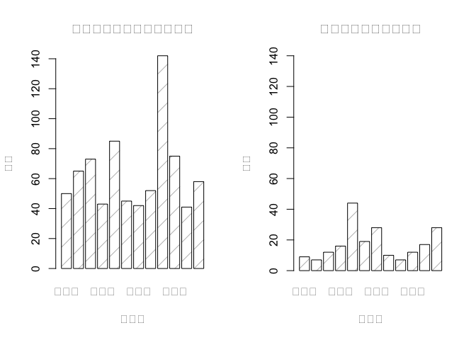

台北市
================

作業說明 （繳交時請直接刪除這個章節）
-------------------------------------

作業目的：期末專題暖身

依下列指示，完成期末分析專題作業規劃：

-   訂出分析問題，並將R Markdown的一級標題(第一行的title:)中的"長庚大學 大數據分析方法 作業六"取代為期末專題的分析問題，並在分析議題背景前加上組員姓名 (`10pt`)
-   分析議題背景 (`10pt`) 與動機 (`10pt`)
-   資料說明 (`10pt`) 與 載入 (`10pt`)
-   資料處理與清洗 (`10pt`) 說明 (`10pt`)
-   對資料們進行探索式資料分析，圖文並茂佳!(`20pt`)
-   期末專題分析規劃與假設 (`10pt`)

組員
----

陳哲安 劉喜媚

分析議題背景
------------

台北市為全台灣的政經中心，聚集了各式各樣的人才、企業，也因此人口流動快速。然而，人口眾多相對也容易造成一些竊盜的事件發生， 如何有效的去預防、追查竊盜事件發生，也是當務之急。

分析動機
--------

生為台灣的首都，許多的竊盜事件都容易影響台灣的形象，因此如何有效的預防、追查竊盜事件是很重要的。預計透過台北市人口資料、警察局分配位置、竊盜事件發生位置來探討個區域的安全性，或是作為警察局建立攝影機的參考。

使用資料
--------

1.臺北市汽車竊盜點位資訊 來源：台北市政府資料開放平台 資料類型：CSV 主要欄位：案類(Type)、發生(現)日期(Date) 、發生時段(Time)、地點(Location) 日期：106年03月13日

2.臺北市自行車竊盜點位資訊 來源：台北市政府資料開放平台 資料類型：CSV 主要欄位：案類(Type)、發生(現)日期(Date) 、發生時段(Time)、地點(Location) 日期：106年03月13日

3.臺北市政府警察局名稱及地址 來源：台北市政府資料開放平台 資料類型：CSV 主要欄位：標題、內容、交通資訊、顯示用地址、系統辨識用地址
日期：106年03月14日

4.村里戶數、單一年齡人口 來源：內政部資料開放平台 資料類型：CSV 主要欄位：戶數、單一年齡性別、單一年齡人口數 日期：106年01月18日

5.鄉鎮市區界線(TWD97經緯度) 來源：政府資料開放平台 資料類型：SHP 主要欄位：鄉(鎮、市、區)界線(TWD97經緯度) 日期：104年10月07日

載入使用資料們

``` r
#install.packages("data.table")
library(data.table)
car <- fread("~/Desktop/R Final/txt/car.txt" ,colClasses = "character")
bike <- fread("~/Desktop/R Final/txt/bike.txt" ,colClasses = "character")
police <- fread("~/Desktop/R Final/txt/police.txt" ,colClasses = "character")
people <- fread("~/Desktop/R Final/opendata10512M030.csv",colClasses = "character" , skip = 1)
```

資料處理與清洗
--------------

-   從台灣總人口數的表，清出只有台北市的資料，再去統整台北市各區域的人口數
-   統計台北市各區域汽車偷竊次數
-   統計台北市各區域自行車偷竊次數
-   統計台北市各區域警察局量

處理資料

``` r
library(dplyr)
```

    ## -------------------------------------------------------------------------

    ## data.table + dplyr code now lives in dtplyr.
    ## Please library(dtplyr)!

    ## -------------------------------------------------------------------------

    ## 
    ## Attaching package: 'dplyr'

    ## The following objects are masked from 'package:data.table':
    ## 
    ##     between, first, last

    ## The following objects are masked from 'package:stats':
    ## 
    ##     filter, lag

    ## The following objects are masked from 'package:base':
    ## 
    ##     intersect, setdiff, setequal, union

``` r
##人口表
##people_taipei 只有台北市的人口資料
##people_taipei_area 台北市各區域的總人口，男生人口，女生人口
people_taipei <- people[grepl("臺北市",people$區域別),]
people_taipei_area <- group_by(people_taipei,區域別) %>% summarise(people_total = sum(as.numeric(人口數)) , people_man = sum(as.numeric(`人口數-男`)) , people_woman = sum(as.numeric(`人口數-女`)))
people_taipei_area$地區 <- substr(people_taipei_area$區域別 , start = 4 , stop = 6)

##汽車偷竊
##cartotal 台北市各區域汽車偷竊次數
car$地區 <- substr(car$`發生(現)地點`,start = 4,stop = 6)
cartotal <- group_by(car,地區) %>% summarise(carnumber = n()) #地區&時段

##自行車偷竊
##biketotal 台北市各區域自行車偷竊次數
bike$地區 <- substr(bike$`發生(現)地點` , start = 4 , stop = 6) 
biketotal <- group_by(bike,地區) %>% summarise(bikenumber = n())

##警察局
##台北市各區域警察局總數
police$地區 <- substr(police$poi_addr , start = 4 , stop = 6)
policetotal <-  group_by(police,地區) %>% summarise(policenumber = n())

##資料結合
##merge3 有台北市各區域總人口、男生人口數、女生人口數、汽車發生偷竊次數、自行車發生偷竊次數、警察局總數
merge1 <- full_join(people_taipei_area,cartotal,by="地區")
merge2 <- full_join(merge1,biketotal,by="地區")
merge3 <- full_join(merge2,policetotal,by="地區")
```

探索式資料分析
--------------

圖文並茂圖文並茂

``` r
#這是R Code Chunk

# install.packages("showtext")
# library(showtext)
# showtext.auto(enable = TRUE)
library(ggplot2)
merge3<-mutate(merge3, "竊盗總數"=carnumber+bikenumber)
merge3
```

    ## # A tibble: 12 × 9
    ##          區域別 people_total people_man people_woman   地區 carnumber
    ##           <chr>        <dbl>      <dbl>        <dbl>  <chr>     <int>
    ## 1  臺北市中山區       231247     107850       123397 中山區        50
    ## 2  臺北市中正區       160403      76610        83793 中正區        65
    ## 3  臺北市信義區       227823     108923       118900 信義區        73
    ## 4  臺北市內湖區       287733     137619       150114 內湖區        43
    ## 5  臺北市北投區       257370     124186       133184 北投區        85
    ## 6  臺北市南港區       122516      59907        62609 南港區        45
    ## 7  臺北市士林區       289939     140011       149928 士林區        42
    ## 8  臺北市大同區       130071      63469        66602 大同區        52
    ## 9  臺北市大安區       311506     145617       165889 大安區       142
    ## 10 臺北市文山區       275231     132153       143078 文山區        75
    ## 11 臺北市松山區       208326      97953       110373 松山區        41
    ## 12 臺北市萬華區       193539      95212        98327 萬華區        58
    ## # ... with 3 more variables: bikenumber <int>, policenumber <int>,
    ## #   竊盗總數 <int>

``` r
summary(merge3$bikenumber)
```

    ##    Min. 1st Qu.  Median    Mean 3rd Qu.    Max. 
    ##    7.00    9.75   14.00   17.42   21.25   44.00

``` r
hist.bike<-merge3$bikenumber
names(hist.bike)<-merge3$地區
barplot(hist.bike, xlab = "區域別", ylab = "次數", main ="自行車在各區被竊盗的次數",density=5, ylim=c(0, 140))
```



``` r
shapiro.test(merge3$bikenumber) #不服從常態分配
```

    ## 
    ##  Shapiro-Wilk normality test
    ## 
    ## data:  merge3$bikenumber
    ## W = 0.84993, p-value = 0.03664

``` r
summary(merge3$carnumber)
```

    ##    Min. 1st Qu.  Median    Mean 3rd Qu.    Max. 
    ##   41.00   44.50   55.00   64.25   73.50  142.00

``` r
hist.bike<-merge3$carnumber
names(hist.bike)<-merge3$地區
barplot(hist.bike, xlab = "區域別", ylab = "次數", main ="車在各區被竊盗的次數",density=5)
```


``` r
#車被竊盗的量比自行車的量多出2-3倍
shapiro.test(merge3$carnumber) #不服從常態分配
```

    ## 
    ##  Shapiro-Wilk normality test
    ## 
    ## data:  merge3$carnumber
    ## W = 0.77457, p-value = 0.004885

``` r
cor(merge3$bikenumber, merge3$policenumber)
```

    ## [1] 0.05191303

``` r
cov(merge3$bikenumber, merge3$policenumber) 
```

    ## [1] 1.590909

``` r
cor(merge3$carnumber, merge3$policenumber)
```

    ## [1] 0.001722828

``` r
cov(merge3$carnumber, merge3$policenumber) 
```

    ## [1] 0.1363636

``` r
cor(merge3$竊盗總數, merge3$policenumber) #相關係數皆趨近於零，線性關係很底。
```

    ## [1] 0.02131421

``` r
cov(merge3$竊盗總數, merge3$policenumber) #共變異數的絕對值皆<2,線性關係很弱。
```

    ## [1] 1.727273

``` r
qplot(carnumber+bikenumber, policenumber, data = merge3, main = "各區域竊盜事件數與警察局的分佈相關性",xlab = "竊盜事件數", ylab = "警察局數量") 
```


``` r
qplot(bikenumber+carnumber, people_total, data = merge3, main = "各區域竊盜事件數與總人口數相關性",xlab = "竊盜事件數", ylab = "總人口數") #相關性亦是分散的
```


``` r
#steal.car
```

期末專題分析規劃
----------------

期末專題要做XXOOO交叉分析

分析規劃

假設：竊盜事件

警察局和攝影機是否足夠

人口與竊盜事件的發生是否相關 竊盗事件的發生與警察局的位置是否相關， 假設：1. 透過搬移或多蓋警察局是否能減底竊盜事件的發生 竊盗事件的發生與道路攝影機的擺放數量是否有關， 假設：2. 攝影機能幫助減底竊盗事件的發生。 假設：3. 能加快迫查的時間（需要做前後對比，單尾檢定XD～！）
